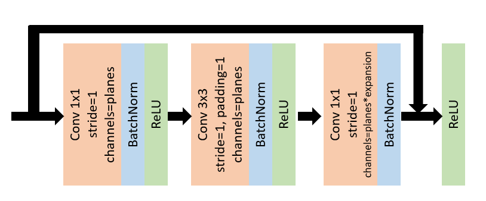
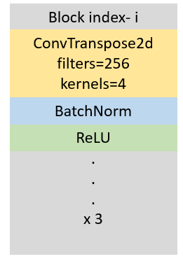

# Task-2

In this task we will detect Facial Action Units (FAUs) from static facial images consisting of varying level of emotions. FAUs are specific regions of the face which allow one to estimate the intensity and type of emotion one is experiencing in a given image. Utility of FAUs has seen a tremendous adoption in research and animation as a result of their unique action coding system. Each facial movement in the FAU coding system is encoded by its appearance on the face. For instance, the AU code for *cheek raise* (AU6) and *lip corner pull* (AU12) when combined together give the *happiness* (AU6+12) emotion. As another example, the AU codes *inner brow raise* (AU1), *brow low* (AU4) and *lip corner depress* (AU15) together give the *sadness* (AU1+4+15) emotion. AU codes start from 0 and end at 28 with the 0th code corresponding to *neutral face*. A complete list of AU codes and their corresponding facial expressions can be found on [Wikipedia](https://en.wikipedia.org/wiki/Facial_Action_Coding_System).

We will utilize FAUs in this task to estimate the intensity of facial expressions and try to link them with their corresponding emotions. However, we will do so without making use of a dataset and only use a handful of images (often referred to as few-shot tuning). For this purpose, we will adopt a slightly modified version of the deep ResNet architecture which is pretrained on a FAU dataset.

Download the code for this task from the Quercus webpage. Package will be downloaded as `Task-2.zip`. Extract the folder to obtain the directory structure consisting of the following folders-  
`src`- The folder contains `train.py`, `network.py` and `run_demo.py`. We will use these to write our program.  
`train`- The folder contains a handful of sample images for finetuning the model.  
`test`- The folder contains a set of 5 test cases.  
`test2`- The folder contains a different set of 5 test cases.  

1. Figure (left) presents modified the ResNet architecture consisting of bottleneck residual blocks and deconvolutional layers. Unlike Task-1, the bottleneck block for this task has not been implemented. Implement the bottleneck block in the `BottleNeck` class by completing the `init` and `forward` functions. The variables have already been created for you. Note that the BatchNorm layer will take an additional *momentum* parameter. **(2 pts)**  
2. The ResNet module is contained in the `ResNet` class which consists of `_make_deconv_layer` function. The `_make_deconv_layer` constructs a deconvolutional block by omitting the residual connections and replacing convolutions with deconvolutions (`ConvTranspose2d`). Figure (right) presents a single deconvolutional block consisting of 3 sub-blocks each having `ConvTranspose2d`, BatchNorm and ReLU layers. Implement the deconvolutional blocks in the `init` function using the `_make_deconv_layer` function. The variables have already been created for you. **(1 pt)**  
3. Execute `run_demo.py` (`python run_demo.py`). This will create the `visualize` folder with a total of 15 images (5 FAU images for each of the 3 subjects). Report the FAU intensity values corresponding to AU17. How do intensity values vary across subjects? How do they vary across FAUs? **(2 pts)**  
4. Replace the contents of `test` folder with that of `test2` folder. Now execute `run_demo.py`. How do intensity values vary across the new subjects? What about the variation across FAUs? **(3 pts)**  
5. Compare emotion recognition in the presence of FAUs with the naive emotion recognition approach taken in Task-1. How and why do the FAUs play a role in better interpretation of emotions? **(3 pts)**  
6. We will now try to improve the model by only using a handful of sample images. The program to train the ResNet architecture is provided in `train.py`. You are required to implement the main training of the loop by zeroing the gradient, differentiating the loss and taking a gradient step using the optimizer. Implement this training procedure in `train.py` and train the model for 5 epochs. This should take approximately 10 minutes of wallclock time on your local CPU machine. Report the final training loss. **(2 pts)**  
7. Change the model path to `tuned_model.pth` and execute `run_demo.py` on the contents of `test2` folder. Does the few-shot finetuning help in estimating intensities of FAUs on the new subjects. If yes, then why? If no, then why not? **(2 pts)**  
8. Now that we have had a chance to implement, understand and train the end-to-end ResNet framework, we will improve the performance of the model with regards to its limitations in effectively estimating FAU intensities. Read **only one** of the following four papers- . What is the main novel idea of the paper? **(2 pts)**  
9. How does the proposed method improve FAU estimation in comparison to the baseline ResNet model implemented above? **(2 pts)**  
10. What are some of the limitations of the proposed method? How can they be addressed? **(2 pts)**  
11. Conduct a small experiment to implement the novel component of the proposed method with the ResNet architecture. Evaluate the modified model on the same test cases from `test` and `test2` folders. Explain your approach and its outcomes in detail.  **(4 pts)**  

